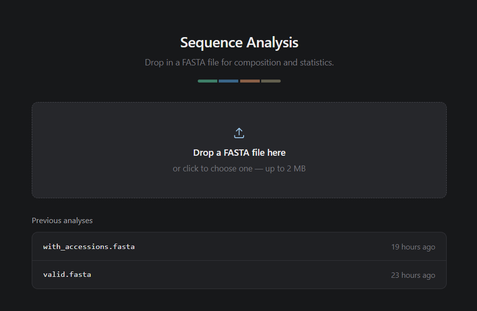
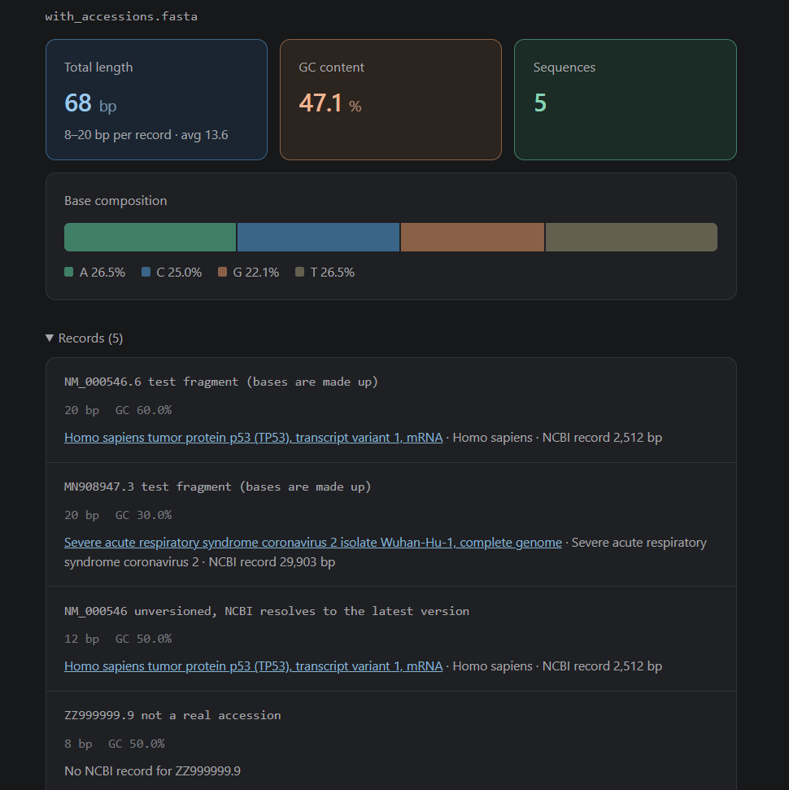
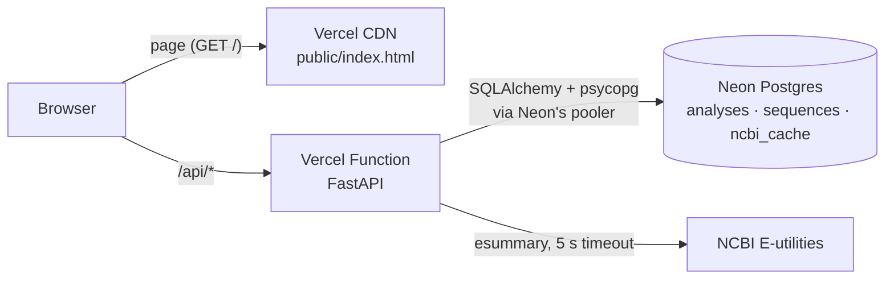

# Sequence Analysis API

[](https://github.com/guidosalustri/sequence-api/actions/workflows/tests.yml)

Upload a FASTA file, get sequence statistics back, browse past analyses, with records enriched from NCBI.

**Live demo: https://sequence-api-peach.vercel.app**

<p align="center">
  
</p>

The point of the project is the backend: **take input from a stranger, handle it safely, store it, and give it back without falling over.** Every rejected input gets a specific status code and a message that says exactly what is wrong, the database can't be filled by abuse, and a slow or broken external API degrades the page instead of breaking it. It runs entirely on free tiers (Vercel Hobby, Neon Free).

<p align="center">
  
</p>

## What's a FASTA file?

FASTA is the standard plain-text format for biological sequences. A file holds one or more **records**: a header line starting with `>`, followed by the sequence, often wrapped over several lines.

```
>seq1 first record
ACGTGGCCAATTGGCCAACGTTAGC
GGCCAATTACGT
>seq2 second record
ATTAAAGGTTTATACCTTCC
```

The first word of a header is usually an identifier. When it's an NCBI accession such as `NM_000546.6`, this project looks the record up and shows what it is.

## Architecture



## API

| Method | Path | Success | Errors |
| --- | --- | --- | --- |
| `POST` | `/api/analyze` | `201`: the stored analysis with per-record stats | `413`, `422`, `503` |
| `GET` | `/api/analyses` | `200`: the newest 50 analyses (summaries) | `503` |
| `GET` | `/api/analyses/{id}` | `200`: one analysis with its records | `404`, `422`, `503` |
| `GET` | `/api/analyses/{id}/ncbi` | `200`: NCBI info keyed by record id, plus `ncbi_available` | `404`, `422`, `503` |
| `GET` | `/api/health` | `200`: never touches the database | |
| `GET` | `/api/db-check` | `200` after `SELECT 1` (a deployment diagnostic with its own error shape) | `503` |

Every other error has the same shape: a stable code for programs and a sentence for people.

```json
{"error": "bad_character", "message": "Line 14, column 5: unexpected character 'J'. Only nucleotide sequences are supported (A, C, G, T/U, N and IUPAC codes)."}
```

GC content is (G+C)/(A+C+G+T): ambiguous bases are excluded, and U counts as T. Interactive docs: [`/docs`](https://sequence-api-peach.vercel.app/docs).

## Validation

Handling bad input is the main feature. The first problem found is reported:

| Input | Status | `error` |
| --- | --- | --- |
| Larger than 2 MB | 413 | `file_too_large` |
| Empty, or only whitespace | 422 | `empty_file` |
| Binary (e.g. a JPEG renamed to `.fasta`) or not UTF-8 | 422 | `not_text` |
| Doesn't start with a `>` header | 422 | `not_fasta` |
| `>` with nothing after it | 422 | `empty_header` |
| Header over 1,000 characters | 422 | `header_too_long` |
| A character outside the nucleotide alphabet (protein, alignment gaps, digits); the message names the line, column and character | 422 | `bad_character` |
| A header with no sequence under it | 422 | `empty_sequence` |
| More than 10,000 records | 422 | `too_many_records` |
| No file in the request, or an id outside the valid range | 422 | `invalid_request` |

Real-world formatting is accepted rather than rejected: Windows and old-Mac line endings, a UTF-8 byte-order mark, blank lines, lowercase bases, spaces inside sequence lines, and unwrapped sequences of any length.

## Design decisions

- **Serverless database access:** `NullPool` with Neon's pooler, and a 10 s connect timeout, so an unreachable database returns a clean `503`.
- **Hand-written parser** for line and column error messages. Characters are validated before uppercasing (`'ß'.upper()` is `'SS'`).
- **Upload limit enforced by reading 2 MiB + 1 byte**, not by trusting `Content-Length`.
- **NCBI at view time, never at upload.** No database connection is held during the call, results are cached in Postgres for 30 days, and any failure degrades to local stats.
- **Storage caps on every table a stranger can grow:** the newest 50 analyses (worst case measured at 3.06 MiB each, about 153 MiB of the 512 MB free tier) and the newest 20,000 NCBI cache rows.
- **Untrusted text is rendered only with `textContent`**, never `innerHTML`.
- **Tests can't reach production:** they connect only through `TEST_DATABASE_URL`.

## Limits

2 MB per file · 10,000 records per file · headers up to 1,000 characters · nucleotide sequences only (DNA/RNA with IUPAC codes) · UTF-8 text · the newest 50 analyses are kept.

## Tests

66 pytest tests cover every validation rule at its boundaries, status codes and error shapes, a database outage, NCBI caching and outages, and the storage caps. The NCBI client is tested against real saved NCBI responses; the suite never calls NCBI itself. [GitHub Actions](.github/workflows/tests.yml) runs it on every push.

## Project layout

```
api/
  index.py        routes, error handling, storage caps
  fasta.py        FASTA parser and validation
  ncbi.py         NCBI E-utilities client
  db.py           engine and table models
  schemas.py      response models
public/index.html the page (vanilla JS, no build step)
scripts/create_tables.py
tests/            pytest suite and fixtures
```
